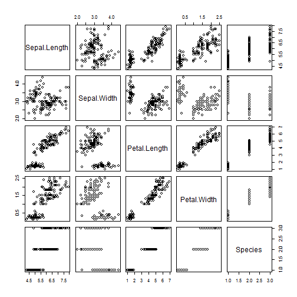

## Introduction

The dataset used for this assignment is iris data set available in R. This famous (Fisher's or Anderson's) iris data set gives the measurements in centimeters of the variables sepal length and width and petal length and width, respectively, for 50 flowers from each of 3 species of iris. The species are Iris setosa, versicolor, and virginica.

The purpose of this exercise is to build a predictive model that would predict the Species of the flower with Sepal.Length, Sepal.Width, Petal.Length and Petal.Width as predictor variables. 

---


## Dataset Details


```
##   Sepal.Length    Sepal.Width     Petal.Length    Petal.Width   
##  Min.   :4.300   Min.   :2.000   Min.   :1.000   Min.   :0.100  
##  1st Qu.:5.100   1st Qu.:2.800   1st Qu.:1.600   1st Qu.:0.300  
##  Median :5.800   Median :3.000   Median :4.350   Median :1.300  
##  Mean   :5.843   Mean   :3.057   Mean   :3.758   Mean   :1.199  
##  3rd Qu.:6.400   3rd Qu.:3.300   3rd Qu.:5.100   3rd Qu.:1.800  
##  Max.   :7.900   Max.   :4.400   Max.   :6.900   Max.   :2.500  
##        Species  
##  setosa    :50  
##  versicolor:50  
##  virginica :50  
##                 
##                 
## 
```


---

```
## 'data.frame':	150 obs. of  5 variables:
##  $ Sepal.Length: num  5.1 4.9 4.7 4.6 5 5.4 4.6 5 4.4 4.9 ...
##  $ Sepal.Width : num  3.5 3 3.2 3.1 3.6 3.9 3.4 3.4 2.9 3.1 ...
##  $ Petal.Length: num  1.4 1.4 1.3 1.5 1.4 1.7 1.4 1.5 1.4 1.5 ...
##  $ Petal.Width : num  0.2 0.2 0.2 0.2 0.2 0.4 0.3 0.2 0.2 0.1 ...
##  $ Species     : Factor w/ 3 levels "setosa","versicolor",..: 1 1 1 1 1 1 1 1 1 1 ...
```

---


## R Code and Output


```r
fit <- lm(Petal.Width ~ Sepal.Length + Sepal.Width + Petal.Length, data=iris)
fit
```

```
## 
## Call:
## lm(formula = Petal.Width ~ Sepal.Length + Sepal.Width + Petal.Length, 
##     data = iris)
## 
## Coefficients:
##  (Intercept)  Sepal.Length   Sepal.Width  Petal.Length  
##      -0.2403       -0.2073        0.2228        0.5241
```

---
## plot                                                                               


 

---


## Solutions

The Solution was built using shiny package in shiny  server.
This model is fitted with the linear model function for multiple regression.
"Species" is the outcome variable and Sepal.Length, Sepal.Width, Petal.Length and
Petal.Width as predictor variables.
Once the user enters the value and click "submit", the predicted Species output can be seen on the main panel
The code has been shared on github and can be accessed at the below location -

  https://github.com/ackulkarni/DevelopingDataProducts
and output can be viewd on shinyApp
  
 http://ackcoursera.shinyapps.io/DevelopingDataProducts
 
 
 ---
 
 
